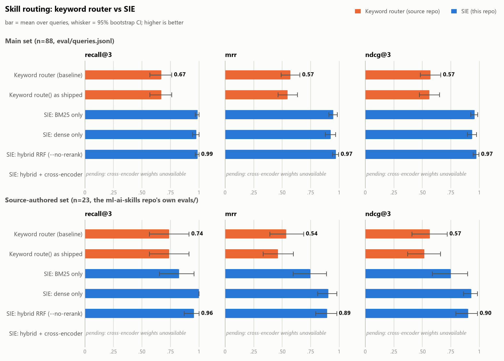

# Benchmarks — SIE vs the keyword baseline

Everything between `BEGIN`/`END` markers is generated:

```bash
python -m eval.run_eval                          # metrics, results.png, per_query.jsonl
python -m eval.collision --source ../ml-ai-skills  # collision case (needs the source git history)
```

## Method

**Systems.** The baseline is the source repo's `scripts/router.py`, vendored byte-for-byte
(`eval/baseline/SOURCE.md`, hash-checked by the tests). It is scored generously: as a *full
ranking* of all 38 skills using its own `score_skill()` and tie-break, with no min-score cut
and no prerequisite expansion. `route()` exactly as shipped (top-5, min-score 1, prerequisites
prepended) is reported as a second row. SIE rows ablate the pipeline: BM25 only, dense only,
hybrid RRF (`--no-rerank`), and hybrid + cross-encoder.

**Query sets.**
- *Main* (`eval/queries.jsonl`, 88 queries, all 8 domains, every skill covered): the scaffold's
  original 12 queries, plus 76 new ones (2 per skill). Those 76 were written by four LLM
  (Claude) writer agents, each given only the skill catalog and told not to run any code,
  retriever or search. Four separate auditor agents then challenged every gold label and
  checked for copied phrasing and fairness to both systems; they rewrote 11 queries and gave
  one query two acceptable skills. The file was frozen (sha256 recorded in Provenance)
  before either system had been run on it. None of the 76 shares a 4-word run with its gold
  skill's description.
- *Source-authored* (`eval/queries_source_evals.jsonl`, 23 queries): the `input` of every
  `evals/*.yaml` behavioral case in ml-ai-skills, with that repo's own skill labels used
  verbatim (`python -m eval.build_source_queries`). Neither system nor its author wrote them.
  Some cases deliberately straddle two skills (e.g. RAG prompt injection vs `ai-ml-security`).

**Metrics.** Each query is scored by the rank of its first acceptable gold skill in the top
10: top-1 (= recall@1), recall@3, MRR, nDCG@3. `[lo, hi]` is a 10,000-resample percentile
bootstrap 95% CI (seed 42). The delta table is paired over the same queries.

**Design choices fixed before any evaluation run, none tuned on these queries:**
- One "Card" chunk per skill (display name + description + capability tags) with the
  description's trailing "NOT for X (see other-skill)" clause dropped. That clause names
  *other* skills' topics.
- A `"<skill> - <section>"` header line on every body chunk.
- all-MiniLM-L6-v2 embeddings; BM25 on lowercase alphanumeric tokens with no stopwords or
  stemming.
- Candidate pool of 20 chunks per retriever, collapsed to the best chunk per skill.
- RRF with k=60.
- Cross-encoder `ms-marco-MiniLM-L-6-v2` over all candidate chunks of the top-20 fused skills,
  with the max chunk score per skill.

<!-- BEGIN:metrics -->
_Generated by `python -m eval.run_eval`; do not edit by hand. Headline system: **SIE: hybrid RRF (--no-rerank)**. Cells are mean <sub>[95% bootstrap CI]</sub>; top-1 = recall@1._

### Observations (computed)

- **Main set:** the stronger single retriever is **BM25 only** (MRR 0.949 vs 0.927). SIE: hybrid RRF (--no-rerank) is +0.023 MRR against it and +0.399 against the keyword router.
- **Source-authored set:** the stronger single retriever is **dense only** (MRR 0.906 vs 0.749). SIE: hybrid RRF (--no-rerank) is -0.011 MRR against it and +0.359 against the keyword router.
- The keyword router is strongest on `-` queries (top-1 0.92; `-` marks the scaffold's original 12) and weakest on `symptom` queries (top-1 0.00).



### Main set — `eval/queries.jsonl` (n=88)

| System | top-1 | recall@3 | mrr | ndcg@3 |
| --- | :---: | :---: | :---: | :---: |
| Keyword router (baseline) | 0.432 <sub>[0.33, 0.53]</sub> | 0.670 <sub>[0.57, 0.76]</sub> | 0.573 <sub>[0.49, 0.66]</sub> | 0.572 <sub>[0.48, 0.66]</sub> |
| Keyword route() as shipped | 0.409 <sub>[0.31, 0.51]</sub> | 0.670 <sub>[0.57, 0.76]</sub> | 0.548 <sub>[0.46, 0.63]</sub> | 0.562 <sub>[0.47, 0.65]</sub> |
| SIE: BM25 only | 0.920 <sub>[0.86, 0.97]</sub> | 0.989 <sub>[0.97, 1.00]</sub> | 0.949 <sub>[0.91, 0.98]</sub> | 0.959 <sub>[0.92, 0.99]</sub> |
| SIE: dense only | 0.886 <sub>[0.82, 0.95]</sub> | 0.977 <sub>[0.94, 1.00]</sub> | 0.927 <sub>[0.88, 0.97]</sub> | 0.938 <sub>[0.89, 0.97]</sub> |
| **SIE: hybrid RRF (--no-rerank)** | 0.955 <sub>[0.91, 0.99]</sub> | 0.989 <sub>[0.97, 1.00]</sub> | 0.972 <sub>[0.94, 0.99]</sub> | 0.975 <sub>[0.94, 1.00]</sub> |
| SIE: hybrid + cross-encoder | _pending_ | _pending_ | _pending_ | _pending_ |

Headline vs baseline, paired over the same queries — per-query reciprocal rank: SIE better on **50**, keyword better on **0**, tied on 38:

| metric | keyword | SIE: hybrid RRF (--no-rerank) | delta | 95% CI (paired) |
| --- | :---: | :---: | :---: | :---: |
| top-1 | 0.432 | 0.955 | +0.523 | [+0.420, +0.625] |
| recall@3 | 0.670 | 0.989 | +0.318 | [+0.227, +0.420] |
| mrr | 0.573 | 0.972 | +0.399 | [+0.319, +0.479] |
| ndcg@3 | 0.572 | 0.975 | +0.403 | [+0.316, +0.490] |

### Source-authored set — the ml-ai-skills repo's own `evals/` cases (n=23)

| System | top-1 | recall@3 | mrr | ndcg@3 |
| --- | :---: | :---: | :---: | :---: |
| Keyword router (baseline) | 0.348 <sub>[0.17, 0.57]</sub> | 0.739 <sub>[0.57, 0.91]</sub> | 0.536 <sub>[0.39, 0.69]</sub> | 0.566 <sub>[0.41, 0.72]</sub> |
| Keyword route() as shipped | 0.217 <sub>[0.04, 0.39]</sub> | 0.739 <sub>[0.57, 0.91]</sub> | 0.464 <sub>[0.33, 0.60]</sub> | 0.518 <sub>[0.37, 0.66]</sub> |
| SIE: BM25 only | 0.652 <sub>[0.43, 0.83]</sub> | 0.826 <sub>[0.65, 0.96]</sub> | 0.749 <sub>[0.60, 0.89]</sub> | 0.751 <sub>[0.59, 0.90]</sub> |
| SIE: dense only | 0.826 <sub>[0.65, 0.96]</sub> | 1.000 <sub>[1.00, 1.00]</sub> | 0.906 <sub>[0.81, 0.98]</sub> | 0.930 <sub>[0.86, 0.98]</sub> |
| **SIE: hybrid RRF (--no-rerank)** | 0.826 <sub>[0.65, 0.96]</sub> | 0.957 <sub>[0.87, 1.00]</sub> | 0.895 <sub>[0.79, 0.98]</sub> | 0.903 <sub>[0.79, 0.98]</sub> |
| SIE: hybrid + cross-encoder | _pending_ | _pending_ | _pending_ | _pending_ |

Headline vs baseline, paired over the same queries — per-query reciprocal rank: SIE better on **13**, keyword better on **3**, tied on 7:

| metric | keyword | SIE: hybrid RRF (--no-rerank) | delta | 95% CI (paired) |
| --- | :---: | :---: | :---: | :---: |
| top-1 | 0.348 | 0.826 | +0.478 | [+0.261, +0.696] |
| recall@3 | 0.739 | 0.957 | +0.217 | [+0.000, +0.435] |
| mrr | 0.536 | 0.895 | +0.359 | [+0.181, +0.533] |
| ndcg@3 | 0.566 | 0.903 | +0.336 | [+0.151, +0.521] |

### Breakdown (main set)

| domain | n | keyword top-1 | SIE top-1 | keyword MRR | SIE MRR |
| --- | :---: | :---: | :---: | :---: | :---: |
| classical-ml | 18 | 0.50 | 0.94 | 0.59 | 0.97 |
| llm | 17 | 0.35 | 1.00 | 0.54 | 1.00 |
| mlops | 13 | 0.46 | 0.92 | 0.63 | 0.95 |
| deep-learning | 12 | 0.67 | 1.00 | 0.76 | 1.00 |
| specialized | 11 | 0.18 | 0.91 | 0.45 | 0.93 |
| foundations | 8 | 0.38 | 0.88 | 0.44 | 0.94 |
| responsible-ai | 7 | 0.57 | 1.00 | 0.68 | 1.00 |
| security | 2 | 0.00 | 1.00 | 0.07 | 1.00 |

| style | n | keyword top-1 | SIE top-1 | keyword MRR | SIE MRR |
| --- | :---: | :---: | :---: | :---: | :---: |
| task | 38 | 0.42 | 0.95 | 0.57 | 0.97 |
| question | 15 | 0.40 | 0.93 | 0.58 | 0.97 |
| symptom | 13 | 0.00 | 0.92 | 0.17 | 0.94 |
| - | 12 | 0.92 | 1.00 | 0.94 | 1.00 |
| terse | 10 | 0.50 | 1.00 | 0.64 | 1.00 |

| set | n | keyword top-1 | SIE top-1 | keyword MRR | SIE MRR |
| --- | :---: | :---: | :---: | :---: | :---: |
| authored | 76 | 0.36 | 0.95 | 0.51 | 0.97 |
| scaffold | 12 | 0.92 | 1.00 | 0.94 | 1.00 |

<details><summary>Every main-set query where SIE: hybrid RRF (--no-rerank) misses the top-3</summary>

| query | gold | SIE top-3 | SIE rank | keyword top-3 |
| --- | --- | --- | :---: | --- |
| New items added to our catalog never get recommended because nobody has interacted with them yet. How do I get around that? | `recommender-systems` | agent-evaluation, ml-problem-framing, rag-evaluation | 5 | prompt-engineering, agents-and-tools, ai-ethics-fairness |

</details>

<details><summary>Every source-set query where SIE: hybrid RRF (--no-rerank) misses the top-3</summary>

| query | gold | SIE top-3 | SIE rank | keyword top-3 |
| --- | --- | --- | :---: | --- |
| Walk me through deploying this new model version to replace the current production model. | `model-deployment` | experiment-tracking, ci-cd-for-ml, ml-monitoring | 4 | supervised-learning, model-deployment, ci-cd-for-ml |

</details>

### Provenance

- corpus: `data/skills` (38 skills, 297 chunks, fingerprint `f4b5d55da6d7c783`)
- queries: `eval/queries.jsonl` sha256 `25bfe6665e7e`, `eval/queries_source_evals.jsonl` sha256 `282591082f8e`
- dense: all-MiniLM-L6-v2 via `onnx` embedder, ChromaDB 1.5.9 (cosine HNSW, persisted to `data/chroma/`); sparse: rank-bm25 0.2.2; fusion: RRF k=60 over the top-20 chunks of each retriever
- keyword baseline: vendored verbatim, see `eval/baseline/SOURCE.md`
- **SIE: hybrid + cross-encoder: pending** — cannot load cross-encoder 'cross-encoder/ms-marco-MiniLM-L-6-v2' (no local weights and the Hugging Face hub is unreachable); copy the weights into data/models/ms-marco-MiniLM-L-6-v2/ or set SIE_RERANKER, or run with --no-rerank
<!-- END:metrics -->

## Vocabulary-collision case

The source repo's `docs/ROUTING.md` documents a real keyword-router failure: for a fraud-
detection task it returned `computer-vision` first because "detection" also appears in
"object detection". The source repo's later capability-tag audit changed the router's answer
on that query (the doc says so itself). So the case is reproduced twice: on the historical
corpus where the failure was observed, and on today's corpus.

<!-- BEGIN:collision -->
_not generated yet — run `python -m eval.collision`_
<!-- END:collision -->
